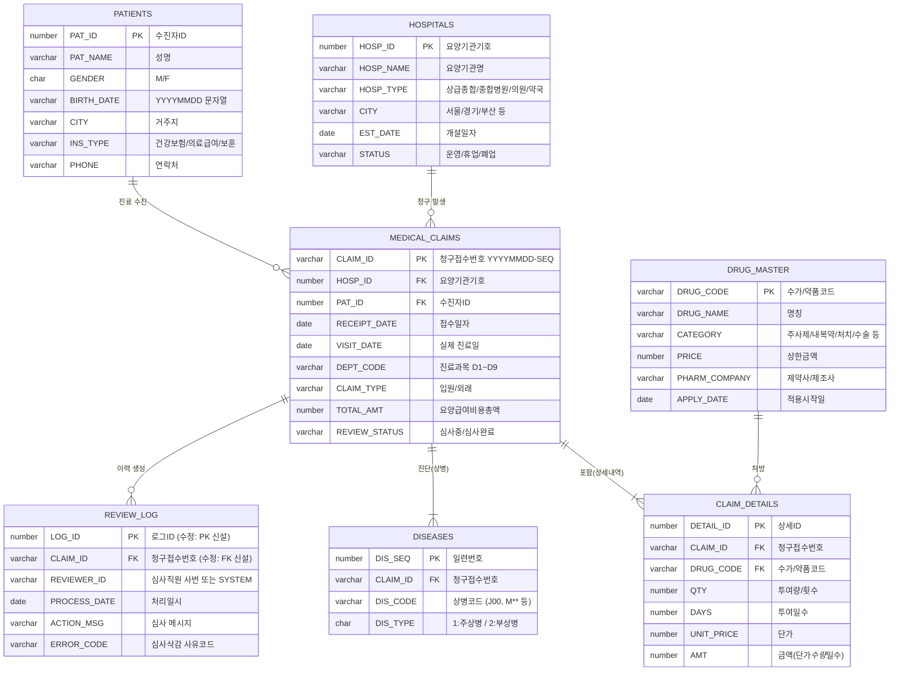

# 진료비 청구 및 심사 시스템 — ERD

`진료비 청구 및 심사 시스템.pdf`의 DDL(CREATE TABLE 문)을 기준으로 실제 컬럼·PK·FK를 그대로
반영해 다시 작성한 ERD입니다. PDF 안에 있던 약식 다이어그램(엔티티별 대표 컬럼 몇 개만 표시)과
달리, 아래는 **7개 테이블의 전체 컬럼과 정확한 PK/FK 관계**를 담았습니다. 단, `REVIEW_LOG`의
PK/FK는 원본 DDL에는 없던 것으로, `진료비청구심사_스키마_생성스크립트_수정본.md`에서 다루는
수정 사항이 반영된 상태입니다(아래 "REVIEW_LOG 관련 수정" 참고).

## ERD (Mermaid)



## 관계 요약

| 관계 | 카디널리티 | 비고 |
|---|---|---|
| HOSPITALS → MEDICAL_CLAIMS | 1 : N | 병원 하나가 여러 청구서를 발생시킴. HOSP_ID FK는 NOT NULL |
| PATIENTS → MEDICAL_CLAIMS | 1 : N | 환자 한 명이 여러 청구서의 대상이 됨. PAT_ID FK는 NOT NULL |
| MEDICAL_CLAIMS → CLAIM_DETAILS | 1 : N (최소 1건) | "청구서는 반드시 1건 이상의 상세내역을 가짐"이라는 업무 규칙은 **DB 제약조건으로는 강제되지 않는다** — DETAIL_ID/CLAIM_ID FK만으로는 "자식이 0건인 부모"를 막을 수 없으므로, 실제로 강제하려면 애플리케이션 로직이나 트리거가 필요하다 (뒤에 나올 PL/SQL 실습에서 다룰 소재) |
| DRUG_MASTER → CLAIM_DETAILS | 1 : N | 약품/수가 코드 하나가 여러 상세내역에서 처방됨 |
| MEDICAL_CLAIMS → DISEASES | 1 : N (최소 1건) | 위와 동일하게 "최소 1건" 규칙은 FK만으로는 미보장. 정상 데이터라면 DIS_TYPE='1'(주상병) 1건은 항상 존재하고, DIS_TYPE='2'(부상병)는 있을 수도 없을 수도 있음 |
| MEDICAL_CLAIMS → REVIEW_LOG | 1 : N (0건 가능) | 청구서가 아직 심사 로그를 하나도 안 받았을 수 있음(REVIEW_LOG.CLAIM_ID가 원본 DDL에서 NOT NULL이 아님) |

## REVIEW_LOG 관련 수정

PDF 원본 DDL에서 `REVIEW_LOG`는 다른 6개 테이블과 달리 **PK/FK 제약조건이 전혀 없습니다.**
반면 PDF 뒷부분의 (약식) ERD 텍스트에는 `MEDICAL_CLAIMS ||--o{ REVIEW_LOG : "이력생성"` 관계가
이미 명시돼 있어, "관계는 있는데 DB에는 강제되지 않는" 불일치가 있었습니다. 이 ERD와
`진료비청구심사_스키마_생성스크립트_수정본.md`에서는 다음을 추가해 이 불일치를 해소했습니다.

```sql
CONSTRAINT PK_REVIEW_LOG PRIMARY KEY (LOG_ID),
CONSTRAINT FK_LOG_CLAIM FOREIGN KEY (CLAIM_ID) REFERENCES MEDICAL_CLAIMS(CLAIM_ID)
```

원본처럼 PK 없이 두는 것이 "PK/인덱스 생성 실습을 학생이 직접 하게 만들려는 의도"였을 가능성도
있어(원본 주석: "PK 인덱스 실습을 위해 PK 외의 인덱스는 데이터 생성 후 실습 파일의 지시에 따라
생성") 완전히 틀린 설계라고 단정하긴 어렵지만, 50만 건짜리 테이블에 고유 식별자도 참조 무결성도
전혀 없는 상태로 실습을 시작하는 것은 위험 부담이 크므로 기본값으로는 추가하는 쪽을 권장합니다.
만약 "PK를 나중에 학생이 직접 만들어보는 실습"이 목적이라면, 이 두 CONSTRAINT 줄만 빼고 나머지
수정 사항(TOTAL_AMT/AMT 계산 등)은 그대로 적용하면 됩니다.

## 모델링 관련 참고 사항 (오류는 아니지만 알아두면 좋은 점)

- `PATIENTS.BIRTH_DATE`가 `DATE`가 아니라 `VARCHAR2(8)`(YYYYMMDD)인 것은 실수가 아니라
  의도된 설계입니다(원본 주석: "연령대별 조회 실습"). `TO_DATE`/`SUBSTR` 변환을 직접 연습하게
  만드는 장치이므로 손대지 않았습니다.
- `MEDICAL_CLAIMS.CLAIM_ID`의 접미 7자리는 "일자별 순번"처럼 보이지만 실제로는 전체 루프의
  전역 카운터(`i`, 1~300000)를 그대로 쓰기 때문에, 같은 날짜의 CLAIM_ID들이 0000001부터
  연속으로 이어지지 않고 듬성듬성 흩어져 있습니다. 유일성은 깨지지 않으므로 기능적 오류는
  아니지만, "청구접수번호 (YYYYMMDD-SEQ)"라는 이름이 주는 인상과는 다르다는 점을 알아두면
  좋습니다.
